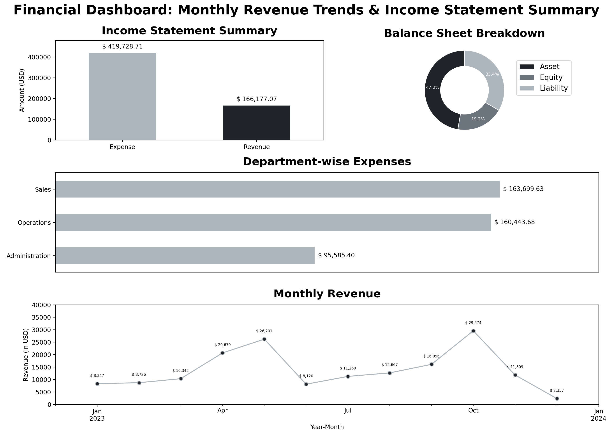

# 📊 Financial Data Analysis Dashboard

This project is an end-to-end analysis and visualization of financial data using Python. The goal is to simulate a mini accounting system by integrating various dimension tables with a general ledger (fact table), perform financial calculations like income statements and balance sheets, derive meaningful KPIs, and present the insights through well-designed visualizations.

---

## 🧾 Project Overview

The analysis focuses on five main CSV datasets:
- `accounts.csv`
- `departments.csv`
- `vendors_customers.csv`
- `dates.csv`
- `general_ledger.csv`

These datasets simulate a real-world accounting system, and are used to generate:
- 📈 Income Statement
- 📉 Balance Sheet
- ✅ Key Performance Indicators (KPIs)

---

## 🧰 Technologies Used

| Tool / Library | Purpose |
|----------------|---------|
| `Pandas`       | Data wrangling, merging, grouping, aggregation |
| `Numpy`        | Numerical operations |
| `Matplotlib`   | Static charts and figure layout (gridspec) |
| `Seaborn`      | Aesthetic styling for plots (optional) |

---

## 📌 Key Highlights

### 1. 📂 Data Cleaning & Preparation
- Converted date fields to datetime.
- Handled missing values in `Description` and flagged missing `PartyID`s.
- Removed duplicates.

### 2. 🔗 Data Integration
- Merged all dimension tables with the general ledger for enriched insights.

### 3. 📑 Financial Calculations
- Generated **Income Statement** from Revenue and Expense accounts.
- Built **Balance Sheet** from Asset, Liability, and Equity accounts.
- Computed **Net Income**, **Profit Margin**, and **Expense Ratio**.

### 4. 📊 Visual Reports
The final visual dashboard contains:
- Bar chart of Income Statement
- Donut (pie) chart of Balance Sheet
- Line plot for Monthly Revenue Trend
- Horizontal bar chart of Department-wise Expenses

The final report layout was organized using `matplotlib.gridspec` and saved as `financial_dashboard.png`.

---

## 📷 Sample Output

<p align="center">
  
</p>

---

## 🏁 How to Run

1. Clone the repository or download the files.
2. Ensure all required libraries are installed:  
   ```bash
   pip install pandas numpy matplotlib seaborn

---

## ✅ Output Files

|File Name			|Description					|
|-------------------------------|-----------------------------------------------|
|`financial_dashboard.png`	|Final combined visual dashboard		|
|`financial_analysis.ipynb`	|Complete analysis and visualization code	|


---

## 👨‍💻 Author
**Chanush KR**  
🔗 [LinkedIn](https://www.linkedin.com/in/chanush-kr)  
🌐 [Portfolio Website](https://sites.google.com/view/chanushkr/home)  
