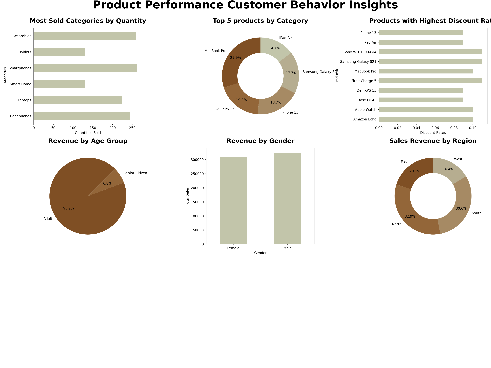
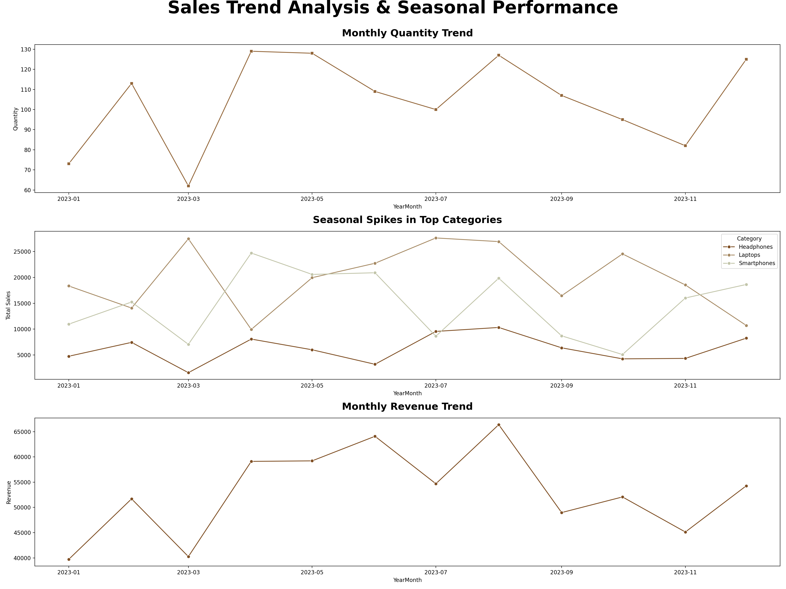

# 🛒 Sales Performance & Customer Insights Dashboard using Python

This project analyzes sales data to uncover key business insights using Python's data analysis and visualization libraries. The analysis includes **product performance**, **customer behavior**, and **sales trends** to help businesses make data-driven decisions.

---

## 📌 Project Overview

This notebook project simulates a real-world sales data analysis pipeline by:
- **Cleaning and transforming** raw sales and dimension data
- **Merging** fact and dimension tables to build a unified dataset
- **Handling missing values** strategically based on domain logic
- **Generating key metrics (KPIs)** such as revenue, total orders, quantity, and discount
- **Visualizing** critical insights across product categories, customer demographics, and sales trends

---

## 📁 Dataset Information

The dataset contains four CSV files:
- `fact_sales.csv` – Main sales transactions (fact table)
- `dim_customers.csv` – Customer details including gender, age, and region
- `dim_products.csv` – Product-related metadata (category, name, unit price)
- `dim_dates.csv` – Date reference with mappings to DateID

---

## 🧹 Data Preprocessing

- Added missing `Date` column using `DateID` via the `map()` function
- Converted the `Date` column to datetime format
- Detected and handled missing values:
  - Dropped rows with missing `CustomerID` or `Quantity`
  - Replaced missing `Discount` values with `0`

---

## 📊 Key Metrics (KPIs)

| Metric                   | Value (Example)     |
|--------------------------|---------------------|
| 💰 Total Revenue         | `$XXX,XXX.XX`       |
| 📦 Total Quantity Sold   | `XX,XXX`            |
| 🧾 Total Orders          | `X,XXX`             |
| 🎯 Avg. Discount Offered | `X.XX%`             |

---

## 📈 Report 1: Product & Customer Behavior Insights

This visual report includes:
- 📊 **Most Sold Categories** by Quantity
- 🥇 **Top 5 Products** by Revenue
- 💸 **Highest Discounted Products**
- 👨‍👩‍👧‍👦 **Revenue by Age Group**
- 🚻 **Revenue by Gender**
- 🌍 **Revenue by Region**

📁 Saved as: `product_customer_insights_report_1.png`

---

## 📉 Report 2: Sales Trend & Seasonal Analysis

This visual report includes:
- 📈 **Monthly Quantity Trend**
- 📆 **Seasonal Spikes** in Top Categories
- 💹 **Monthly Revenue Trend**

📁 Saved as: `sales_trend_seasonal_analysis_report_2.png`

---

## 📌 Tools & Technologies Used

- **Python** – Data analysis and manipulation
- **Pandas** – Merging and cleaning datasets
- **Matplotlib** – Plotting static graphs
- **Seaborn** – Advanced statistical visualizations
- **Jupyter Notebook** – Interactive analysis

---

## 📷 Sample Visualizations

*Product Performance & Customer Insights*

---

*Sales Trend & Seasonal Performance*

---

## 📚 Learning Outcomes

- Applied real-world data cleaning techniques
- Practiced merging fact and dimension tables (data modeling)
- Gained experience in exploratory data analysis (EDA)
- Created professional-level visual reports using Python
- Demonstrated storytelling using business KPIs

---

## 👤 Author

**Chanush KR**  
🔗 [LinkedIn](https://www.linkedin.com/in/chanush-kr)  
🌐 [Portfolio Website](https://sites.google.com/view/chanushkr/home)  
📌 [LinkedIn Post about this Project](https://www.linkedin.com/posts/chanush-kr_datascience-python-dataanalysis-activity-7352255431970344960-YBu3?utm_source=share&utm_medium=member_desktop&rcm=ACoAAD0Tw64BmW6pg1qf8-1ow9qOM-2tCEyFJRw)

---

> If you found this helpful, don’t forget to ⭐️ the repo and connect on LinkedIn!
